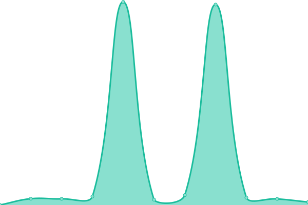
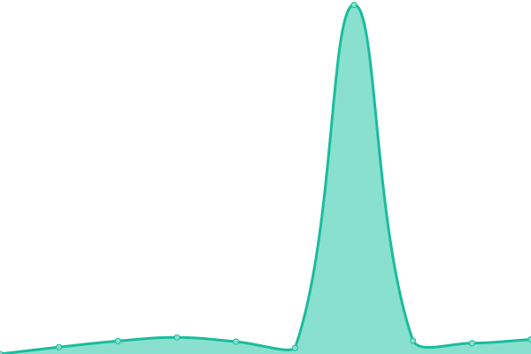
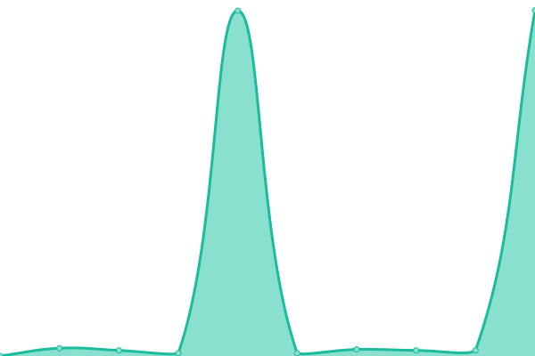

# [📈 Live Status](https://billflix.github.io/upptime): <!--live status--> **🟧 Partial outage**

This repository contains the open-source uptime monitor and status page for [billflix](https://billflix.github.io/upptime), powered by [Upptime](https://github.com/upptime/upptime).

With [Upptime](https://upptime.js.org), you can get your own unlimited and free uptime monitor and status page, powered entirely by a GitHub repository. We use [Issues](https://github.com/billflix/upptime/issues) as incident reports, [Actions](https://github.com/billflix/upptime/actions) as uptime monitors, and [Pages](https://billflix.github.io/upptime) for the status page.

<!--start: status pages-->
<!-- This summary is generated by Upptime (https://github.com/upptime/upptime) -->
<!-- Do not edit this manually, your changes will be overwritten -->
<!-- prettier-ignore -->
| URL | Status | History | Response Time | Uptime |
| --- | ------ | ------- | ------------- | ------ |
|  [Plex](https://plex.billflix.media) | 🟩 Up | [plex.yml](https://github.com/billflix/upptime/commits/HEAD/history/plex.yml) | 

 286ms
     
 | 

<a href="https://billflix.github.io/upptime/history/plex">100.00%</a>
    

|  [Request](https://request.billflix.media) | 🟩 Up | [request.yml](https://github.com/billflix/upptime/commits/HEAD/history/request.yml) | 

 610ms
     
 | 

<a href="https://billflix.github.io/upptime/history/request">100.00%</a>
    

|  [Monitor](https://monitor.billflix.media) | 🟩 Up | [monitor.yml](https://github.com/billflix/upptime/commits/HEAD/history/monitor.yml) | 

 502ms
     
 | 

<a href="https://billflix.github.io/upptime/history/monitor">100.00%</a>
    

|  [Audiobooks](https://audiobooks.billflix.media) | 🟩 Up | [audiobooks.yml](https://github.com/billflix/upptime/commits/HEAD/history/audiobooks.yml) | 

 308ms
     
 | 

<a href="https://billflix.github.io/upptime/history/audiobooks">100.00%</a>
    

|  [Bitwarden](https://bitwarden.billflix.media) | 🟩 Up | [bitwarden.yml](https://github.com/billflix/upptime/commits/HEAD/history/bitwarden.yml) | 

 384ms
     
 | 

<a href="https://billflix.github.io/upptime/history/bitwarden">100.00%</a>
    

|  [Birdnet](https://birdnet.billflix.media) | 🟩 Up | [birdnet.yml](https://github.com/billflix/upptime/commits/HEAD/history/birdnet.yml) | 

 588ms
     
 | 

<a href="https://billflix.github.io/upptime/history/birdnet">100.00%</a>
    

|  [Storage](https://storage.billflix.media) | 🟥 Down | [storage.yml](https://github.com/billflix/upptime/commits/HEAD/history/storage.yml) | 

 2709ms
     
 | 

<a href="https://billflix.github.io/upptime/history/storage">100.00%</a>
    

|  [Games](https://games.billflix.media) | 🟩 Up | [games.yml](https://github.com/billflix/upptime/commits/HEAD/history/games.yml) | 

 308ms
     
 | 

<a href="https://billflix.github.io/upptime/history/games">100.00%</a>
    

<!--end: status pages-->

[**Visit our status website →**](https://billflix.github.io/upptime)

## 📄 License

- Powered by: [Upptime](https://github.com/upptime/upptime)
- Code: [MIT](./LICENSE) © [Anand Chowdhary](https://anandchowdhary.com), supported by [Pabio](https://pabio.com)
- Data in the `./history` directory: [Open Database License](https://opendatacommons.org/licenses/odbl/1-0/)
